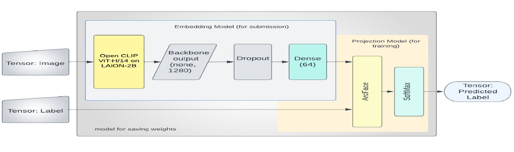

# google-universal-image-embedding-challenge
ASU EEE 511 Artificial Neural Computation Project- 
Deep Leaning based solution for Google Universal Image Embedding Kaggle Challenge 

Challenge: https://www.kaggle.com/competitions/google-universal-image-embedding
Model Link: https://drive.google.com/drive/folders/14nJR6n4yky6zWa28r1zR_fN81mnIOFQo?usp=share_link
(Load this model in submission folder)
Kaggle Notebook: https://www.kaggle.com/code/dhanrajbhosale/team-9-anc-project-universal-image-embedding/notebook
## Introduction
Image representations are a critical building block of computer vision applications.  Capturing features of all
object domains in a single dataset and training a model that can
distinguish between them is challenging. The work presented
here is structured in a representation learning format to create
a model that extracts feature embedding for the images. This
generated model is submitted via Kaggle Notebooks to be
verified on a held-out test set, performs a k-nearest-neighbors
lookup, and scores the resulting embedding quality. Google
research believes this multi-domain ILR is the key to real-
world visual search applications, such as augmenting cultural
exhibits in a museum, organizing photo collections, visual
commerce, and more.
## Methodology
## Datasets
Since the task is to classify objects at the instance level,
the corresponding datasets should select instance-level data.
After collecting information from major open
websites, the selected datasets are as follows.

• Imagenet - 1K classes https://www.image-net.org/index.php
[

• Products10K - https://products-10k.github.io 

• Google Landmark Recognition 2021 - Top 7k class images -https://www.kaggle.com/competitions/landmarkrecognition-2021/data
A total of 17K classes of objects were used for training. To
reduce the size of the dataset, only 50 images per class were
taken into the dataset. The data was split such that 90 percent
is used for training, while 10 percent is used for validation.
So a total of 478185 images for training and 62828 images
for validation.

## Model Architecture
This the overview of our model architecture 

**Embedded model for Inference (Model Submitted for scoring): Backbone(CLIP) +Dropout + Dense(units=64) + L2 Norm**

**Training Model: Backbone(CLIP) + Dropout + Dense(64-D) + ArcFace + Softmax(17691 classes)**

## Implementation
### Configuration
We used Kaggle Notebook - TPU V3-8,8 cores and
16 GB ram- for training our model.
### Hyperparameter Tuning
We used Adam as the optimizer for the model. The
Batch size was set at 1600, with 200 samples for each TPU
core. We did 10 epochs for training our model.
We used a learning rate scheduler for each epoch: a Linear
Warmup With Linear Decay. It is a learning rate schedule in
which we increase the learning rate linearly for updates for
the initial few epochs and then linearly decay afterward
### Simulation
To simulate the image retrieval that the competition will
perform on the privately held data, we developed a dataset of 150 random images.ypu can check it out here `Datasets`
## Results
The model trained and submitted by us for the competition
scored 0.681 which is at par with the top 10 score amongst
all competitors.Submissions are evaluated according to the mean Precision@5 metric, introducing a small modification to avoid
penalizing queries with fewer than 5 expected index images.
 The resuts of smulations is given here`ConsoleOutput`
### Learnings && Future Enhancements
We obtained good results when we did the simulation of the
embedding model. The top 5 images extracted from the dataset
always matched the test image category. Due to the CLIP
model’s zero-shot capabilities, we obtained similar images of
a test image whose class was not included in the training or
validation dataset.
This project helps us to understand how a transformer model
can be used in a computer vision application

This model can be further improved to take care of tricky
cases like identifying the difference between an actual Eiffel
tower and a souvenir or replica of the Eiffel tower. Increasing
the classification categories beyond the current 17K classes
might make the embeddings even more universal. This improvement
requires training with additional datasets on a
more significant number of instances. New approaches for
model training can be used. E.g. Continuous training may
be deployed in applications where images are continuously
processed, like Google lens.